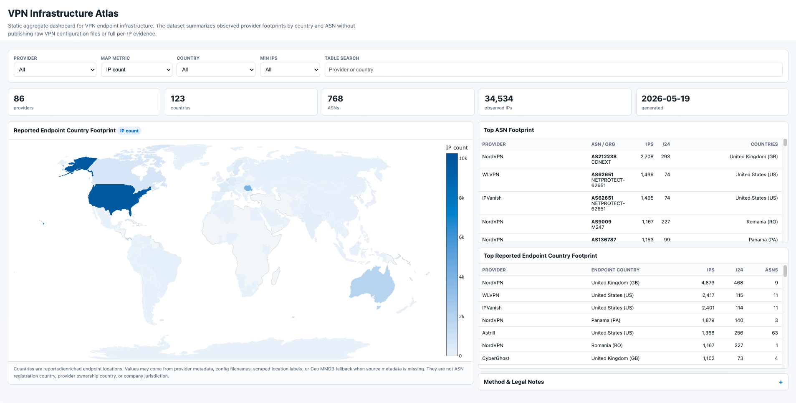

# VPN Infrastructure Atlas
[Open Interactive Atlas](https://ipanalytics.github.io/VPN-Infrastructure-Atlas/)
## Open Interactive Map

https://ipanalytics.github.io/VPN-Infrastructure-Atlas/

Static public dashboard and aggregate CSV dataset for exploring VPN provider infrastructure footprint by reported endpoint country and ASN/network operator.

This repository does **not** publish raw VPN IP lists. It publishes aggregate signals that help researchers understand where VPN endpoint infrastructure appears, which networks host it, and how provider footprints are distributed.

The project is designed for defensive research, fraud/risk feature engineering, source-quality review, and VPN/proxy detection methodology.



**Open the interactive atlas:** https://ipanalytics.github.io/VPN-Infrastructure-Atlas/


## What You Can Explore

- which reported countries have the largest observed VPN endpoint footprint;
- which ASNs/network operators host the most VPN endpoint infrastructure;
- how one provider's footprint is distributed across countries and ASNs;
- how concentrated or distributed VPN infrastructure appears in a current snapshot;
- aggregate context useful for IP reputation and VPN/proxy detection research.

## Interactive Atlas

Open [`index.html`](index.html) through GitHub Pages or any static web server to explore the current snapshot.

The atlas includes:

| View | Description |
|---|---|
| World map | Reported/enriched endpoint-country VPN footprint by IP count, `/24` count, ASN count, or hosting IP count. |
| Provider filter | Narrow the map and tables to one provider. |
| Country filter | Narrow the map and tables to one reported/enriched endpoint country. |
| ASN filter | Narrow the map and tables to one ASN/network operator. |
| Linked filters | Provider, country, ASN, and minimum-IP filters constrain each other. |
| Click actions | Click a country on the map, a provider bar, an ASN row, or a country row to filter the atlas. |
| Shareable URL | Current filter state is stored in the URL query string. |
| Export CSV | Download the current filtered `provider-country-ASN` view as CSV. |
| Country table | Top provider/reported-country footprints with IP count, `/24` count, and ASN count. |
| Method & legal notes | Short public-use notes explaining scope, limitations, and license guidance. |

The dashboard is static: HTML, JavaScript, and CSV files only. It does not need a backend.

Current MVP scope:

- current snapshot only, no historical/churn data;
- records where collector output has `type=vpn`;
- Tor, proxy, and relay records excluded;
- aggregate rows only, no raw per-IP feed;
- countries are reported/enriched endpoint-location context, not ASN registration, provider ownership, or company jurisdiction.

## Country Semantics

The atlas uses **reported/enriched endpoint country**.

This field is built from the collector's `country` output. In this project that value can come from several places:

- provider API metadata or server-status metadata;
- location labels scraped from public provider pages;
- config/archive filename heuristics where the provider encodes country/city in filenames;
- local CSV/source metadata;
- Geo MMDB fallback when the source itself did not provide country/city;
- older iptoasn country fallback only when no better country value is available.

That means a row such as:

```csv
provider,country,ip_count
NordVPN,US,1200
```

should be read as:

> 1,200 observed NordVPN endpoint IPs were reported or enriched as United States endpoints in this snapshot.

It does **not** mean:

- the provider company is registered in the United States;
- the ASN owner is registered in the United States;
- the provider owns the network;
- all IPs in that country or ASN are VPN;
- the country is a legal jurisdiction for the VPN brand.

ASN organization is shown as network/operator context. ASN registration country is a different signal and is not the same as reported endpoint country.

Because sources are mixed, country should be treated as practical endpoint-location context, not a hard legal or ownership field.

## License And Legal Notes

Recommended public license for the aggregate CSV and documentation: **CC BY 4.0**.

This repository should not include VPN configuration files, client assets, bearer tokens, account-derived files, APK extracts, raw provider responses, or private mirror artifacts.

The published data is infrastructure context for research and defensive enrichment. Country, ASN, hosting, and provider labels are not claims of ownership, affiliation, malicious behavior, or abuse.

## What This Is Not

This is not a VPN blocklist and not a complete VPN database.

It should not be used to:

- block an entire country, ASN, or hosting provider;
- claim provider ownership or legal jurisdiction;
- label every IP in an ASN as VPN;
- make enforcement decisions without IP-level evidence;
- treat reported country as a hard legal field.

Use this as aggregate infrastructure context, not final attribution.

## Data Files

| File | Description |
|---|---|
| [`data/provider_country.csv`](data/provider_country.csv) | Provider footprint by endpoint country. Used by the interactive map. |
| [`data/provider_asn.csv`](data/provider_asn.csv) | Provider footprint by ASN / network operator. Used by the ASN explorer table. |
| [`data/country_summary.csv`](data/country_summary.csv) | Country-level aggregate footprint across all providers. |
| [`data/asn_summary.csv`](data/asn_summary.csv) | ASN-level aggregate footprint across all providers. |
| [`data/metadata.json`](data/metadata.json) | Snapshot generation metadata. |

## Safe Use

Good uses:

- VPN/proxy detection enrichment;
- provider footprint research;
- ASN and hosting-network context;
- risk feature engineering;
- source quality review;
- identifying infrastructure concentration;
- visual exploration through GitHub Pages.

Bad uses:

- blocking an entire ASN;
- claiming provider ownership from country or ASN alone;
- labeling every IP in a `/24` as VPN;
- using old snapshots without freshness checks;
- treating this as a complete VPN database.
